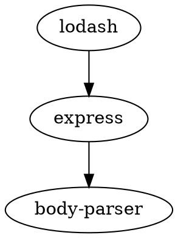

# Dependency Visualizer

## Описание
**Dependency Visualizer** — это инструмент для визуализации графа зависимостей JavaScript (npm) пакетов. Он рекурсивно анализирует зависимости, включая транзитивные, и генерирует граф в формате Graphviz (DOT). 

Этот проект включает как сам инструмент, так и тесты для проверки его функциональности.

---

## Особенности
- **Анализ зависимостей npm-пакетов** (включая транзитивные зависимости).
- **Генерация графа зависимостей** в формате Graphviz.
- **Тестирование функций** с использованием Python.

---

## Требования
- Python 3.6+
- Установленная программа `Graphviz` для визуализации графов (опционально).
- Директория `node_modules` должна существовать и быть правильно настроена (зависимости установлены через `npm install`).

---

## Установка
Установите необходимые зависимости (при необходимости):
```bash
pip install -r requirements.txt
```
Использование
Конфигурация
Создайте конфигурационный файл в формате YAML, например config.yaml:
```yaml
graphviz_path: "dot"
package_name: "lodash"
output_path: "output.dot"
```
Параметры:
graphviz_path — путь к программе dot (Graphviz). Если она не установлена, оставьте пустым.
package_name — имя анализируемого пакета.
output_path — путь для сохранения графа в формате DOT.

### Запуск
Убедитесь, что установлены зависимости в папке node_modules:
```bash
npm install
```
Запустите инструмент:
```bash
python dependency_visualizer.py config.yaml
```
В консоли появится граф в формате DOT, а результат будет сохранён в указанный файл.
Пример
Если package.json пакета lodash содержит зависимости:

```json
{
  "dependencies": {
    "express": "^4.17.1"
  }
}
```
А у express есть зависимость:

```json
{
  "dependencies": {
    "body-parser": "^1.19.0"
  }
}
```
Граф зависимостей будет таким:


Визуализация
Для создания изображения графа с использованием Graphviz, выполните:
```bash
dot -Tpng output.dot -o output.png
```
### Тестирование
Описание тестов
Тесты проверяют:
Загрузку конфигурации (test_load_config).
Парсинг файлов package.json (test_parse_package_json).
Рекурсивное построение зависимостей (test_resolve_dependencies).
Запуск тестов
Выполните:
```bash
python test_dependency.py
```
Если тесты проходят успешно, вы увидите:
```css
test_load_config passed!
test_parse_package_json passed!
test_resolve_dependencies passed!
All tests passed!
```

# config2
